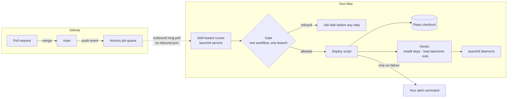
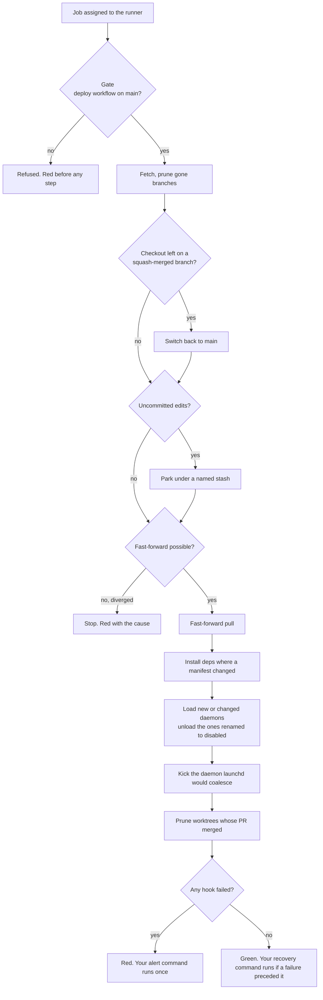

# gangplank

Hands-off, reliable deploys to the Mac that runs your agents. Merge it, and your machine is running it.

      

gangplank turns a GitHub self-hosted runner into a deploy-only agent for one Mac. A merge to main lands on the machine in seconds, through one door, never by force. No open port, no tunnel, no secret to rotate.

Built for machines that run long-lived things: OpenClaw, Claude Code loops, daemons, dashboards.

It is made for the way that machine actually gets developed: some changes arrive as merged PRs from wherever you are, and some you make by hand sitting at the box. gangplank keeps both true at once. Your on-box edits are never overwritten by a deploy, and a deploy never waits for you to clean them up.

## What gangplank adds

The runner and git do the transport. gangplank adds what neither does:

- **The gate.** The runner will run any job it is handed; the gate refuses all but one named workflow on one named branch, fails closed if it cannot verify, and makes no network calls. That is what makes a self-hosted runner safe on a machine that holds secrets.
- **Refuse instead of force.** Divergence, a failed fetch, or a tree that cannot fast-forward stops the deploy and says why. Never a reset.
- **Park, do not re-apply, and only when a pull actually happens; a failed pull puts them back.** Your uncommitted edits on the box are set aside under a named stash and left there. A deploy never edits your working files.
- **Self-heal from a stranded checkout.** A box left on a branch that has since squash-merged is put back on main and deployed.
- **Install only what changed.** Dependencies are reinstalled only in the packages whose manifest moved in this deploy.
- **Daemons ship with their code.** A new or changed launchd definition is loaded on the deploy that carries it; one renamed to disabled is unloaded.
- **Restarts launchd would drop.** Rapid file changes get coalesced into one event and one daemon loses; gangplank kicks it explicitly.
- **Parallel-session cleanup that cannot delete live work.** A worktree goes only when its PR merged, its tree is clean, and no session holds it.
- **Failure-only alerting, to whatever you point it at.** On a failed deploy it runs the command you name, once; on the first real deploy after that it runs your recovery command. Nothing on success, and nothing at all if you name no command; the red run on GitHub is the record.

## Use it

On the Mac, once:

```bash
git clone https://github.com/oficiallyAkshay/gangplank ~/.gangplank/src
~/.gangplank/src/bin/gangplank install --repo you/your-repo
```

That registers a GitHub runner on the machine, runs it as a launchd service, and places the gate outside any checkout so no branch can edit it. `gangplank status`, `gangplank dry-run` and `gangplank uninstall` are the other three verbs.

In your repo, the deploy workflow (full version with every option in `examples/deploy.yml`):

```yaml
on:
  push: { branches: [main] }
  schedule: [{ cron: "17 * * * *" }]
concurrency: { group: deploy, cancel-in-progress: false }
jobs:
  deploy:
    runs-on: [self-hosted, macOS, gangplank]
    steps:
      - uses: oficiallyAkshay/gangplank@v0
        with:
          repo: /Users/you/your-checkout
```

Merge to main, and the Mac has it in seconds.

## How it sits

Nothing on the Mac listens to the internet. The runner asks GitHub for work over an outbound connection, and the gate decides whether that work may run.



## One deploy

Every branch that is not the happy path ends the run red with its cause. Nothing is forced, and nothing of yours is overwritten.



## License

MIT
